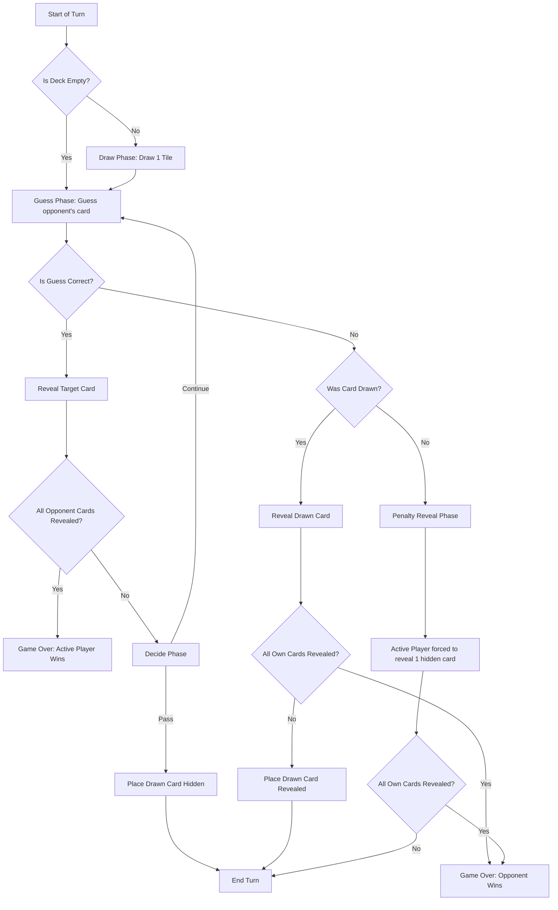

# 🛸✨ Davinci Code (Solo vs AI) — Comprehensive Gameplay Specification

This document details the complete gameplay rules, systems, phase transitions, and AI mechanics of the Davinci Code (Solo vs AI) web application.

---

## 🏗️ 1. Game Components & Setup

### The Tile Pool (Deck)
The game is played with a total of **26 tiles**:
*   **Numbered Tiles (24):** 12 Black tiles and 12 White tiles, each numbered from `0` to `11`.
*   **Joker Tiles (2):** 1 Black Joker and 1 White Joker (initially represented with a value of `-1` / `★`).

### Initial Deal & Sort Order
At the start of the game:
1.  All 26 tiles are shuffled.
2.  Optionally, a number of cards are randomly removed from the pool based on the **Card Removal Configuration** (0, 2, 4, or 6 cards).
3.  Both the Player and the AI are dealt **4 tiles** face-down.
4.  Each hand is automatically sorted in **ascending order** from left to right:
    *   **Rule 1 (Ascending Value):** Lower numbers are placed to the left, higher numbers to the right.
    *   **Rule 2 (Color Tie-Breaker):** If two tiles have the same number, the **Black tile** must be placed to the left of the **White tile**.
    *   **Rule 3 (Joker Flexibility):** Jokers have no default numeric value. During setup, they are assigned a position. Their internal sort value is calculated as the average of the two adjacent cards (or boundaries) to ensure they stay in their manually placed slots.

---

## 🔄 2. Turn Flow & Game Phases

Each turn consists of structured phases, shifting dynamically based on game actions.

### Phase Details

#### A. Draw Phase
*   The active player draws one tile from the deck.
*   This drawn tile is kept in a "drawn" state (hovering above the board, hidden from the opponent) until the guess outcome is resolved.
*   **Empty Deck Transition:** If a turn starts and the deck contains `0` cards, the active player's draw phase is bypassed. The system automatically shifts the game state to the **Guess Phase** without waiting for user action.

#### B. Guess Phase
*   The active player must select one of the opponent’s face-down (hidden) tiles and guess its identity:
    *   For normal cards: Guess the number (0–11) and match its color.
    *   For Jokers: Select the "Joker" option instead of a number.
*   **Correct Guess:**
    *   The guessed tile is permanently revealed (face-up).
    *   The phase transitions to the **Decide Phase**.
*   **Wrong Guess:**
    *   The active player's current drawn card is revealed face-up and inserted into their hand in its correct sorted position.
    *   The turn ends immediately.
    *   **Empty-Deck Penalty Rule:** If the player makes a wrong guess when the deck is `0` (hence no card was drawn), the **Penalty Reveal Phase** (`penalty_reveal`) is triggered. The active player is forced to select and reveal one of their own hidden tiles as a penalty. All other inputs are locked during this penalty selection.

#### C. Decide Phase (Only after a Correct Guess)
*   The active player has two options:
    1.  **Continue:** Make another guess on another hidden opponent card. No new card is drawn.
    2.  **Pass:** End the turn. The drawn card is placed face-down (hidden) in the active player's hand, keeping its identity secret.

#### D. Joker Placement Phase
*   When a player passes or makes a wrong guess with a Joker as their drawn card, the **Joker Placement Phase** is triggered.
*   The player has a **5-second countdown timer** to drag or select the target insertion index in their hand.
*   If the timer reaches `0`, the Joker is automatically placed in a random valid position in their hand.

---

## 🤖 3. AI Opponent Engine

The game features three AI difficulty settings, each utilizing different logic layers:

### Easy AI (Random)
*   **Target Selection:** Selects a random unrevealed player card.
*   **Value Guessing:** Picks a completely random value from the remaining pool of unrevealed tiles, without using ascending order logic or boundary checks.
*   **Pass/Continue Rule:** Always passes immediately after one correct guess.

### Medium AI (Elimination)
*   **Target Selection:** Scans all unrevealed player card positions and checks their left/right boundaries (the nearest revealed cards in the hand).
*   **Value Guessing:** Eliminates impossible values that violate the ascending sorting constraints. It identifies the target position with the fewest possible candidates and makes a random selection from those remaining candidates.
*   **Pass/Continue Rule:** Has a 50% chance to continue guessing up to a maximum of 2 consecutive correct guesses.

### Hard AI (Probability & Human-Like Error)
*   **Target Selection:** Builds a full probability distribution for every single unrevealed tile in the player's hand by cross-referencing:
    *   All cards in its own hand.
    *   All revealed cards on the board.
    *   All removed cards.
    *   Strict sort order constraints.
*   **Value Guessing:** Identifies the player's card with the highest certainty (highest probability of a correct guess). If a card is mathematically guaranteed (100% certainty), it will prioritize guessing it.
*   **Hard AI Human-like Error Margin:** To mimic human mistakes, the Hard AI has a **10% to 15% chance to make a calculation error** (e.g., guessing a number adjacent to the true value) even when it has reached 100% mathematical certainty.
*   **Pass/Continue Rule:** Will always continue guessing if there is another card that can be guessed with 100% certainty. Otherwise, it has a 30% chance to take a risk and continue, up to a maximum of 3 consecutive correct guesses.

---

## 🎨 4. Theme & Interactive Visual Elements

The web app is styled with a cartoon sci-fi aesthetic resembling a retro spaceship cockpit:

*   **Retro Toy Cards:** Styled as thick plastic toy chips with comic-style black borders (`border: 3px solid #050816`), solid offset shadows (`box-shadow: 4px 4px 0px #050816`), and gloss reflection highlights.
*   **Elastic Bounce:** Hovering over selectable cards triggers a springy scaling animation (`transition: transform 0.4s cubic-bezier(0.175, 0.885, 0.32, 1.275)`).
*   **Interactive Mascots:**
    *   **Alien & Astronaut:** Both float continuously at the sides of the screen using keyframe translations.
    *   **Alien Reaction States:** Reacts dynamically to game events (e.g., shocked when you guess correctly, laughing when you guess wrong).
    *   **Idle Trash-Talk Timer:** If the user is inactive for more than **7 seconds** during their turn, the Alien mascot displays a trash-talk speech bubble.
*   **Space Telemetry HUD:** Displays the mission's elapsed time and the current round/turn counter side-by-side in a sci-fi cockpit format at the top of the board.
*   **Mobile Portrait Adaptations:**
    *   On screens narrower than `1000px`, 3D board tilt is disabled (`transform: none !important`) for easy touch selection.
    *   Large mascot illustrations are hidden and replaced by small circular 45px head avatars.
    *   A mobile-optimized **Bottom Sheet Input Panel** slides up when selecting an opponent card to guess, providing big, thumb-friendly buttons.
